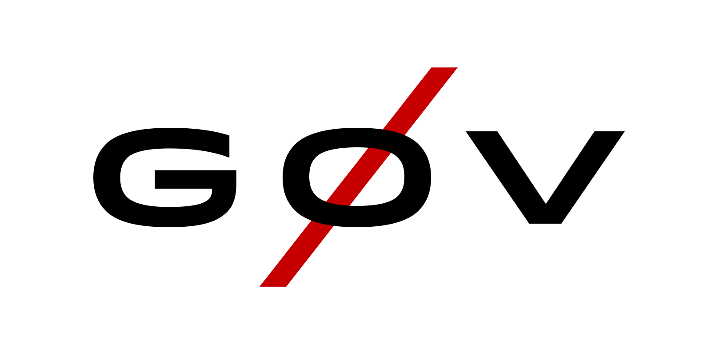

# Overview

## Get Involved

If you'd like to join in on the conversation, great!

1. Read the Civicist article that brought us together:  
    [vTaiwan: Public Participation Methods on the Cyberpunk Frontier of Democracy][civicist]
2. Review our [Contributor Guidelines][contributing] and [Code of
   Conduct][conduct].
3. [Sign up][join-g0v] for the Slack chat tool run by [g0v][about-g0v].
    * Don't be alarmed that most channels are in mandarin! (g0v is a
      really rad civil society group that originates in Taiwan.)
    * Key places for conversation are:
      * vNYC: [`#vnyc-daily`][slack-vnyc-daily], [`#vnyc`][slack-vnyc], [`#vnyc-grants-conf`][slack-vnyc-grants-conf], [`#vnyc-articles`][slack-vnyc-articles]
      * General (English): `#general-en`, `#north-america`
      * Other (Mixed): `#vtaiwan`, `#intl`
4. Review the current list of projects and work with us!
    * Visit our [public Kanban board][kanban] used to track the status of our projects
    * Visit our [GitHub organization][github] used to host our
      open-source software and other resources
5. [Join us][video-calls] for a video call stand-up meeting, daily at 11am
   ET.

<!-- Links -->
   [civicist]: https://civichall.org/civicist/vtaiwan-democracy-frontier/
   [contributing]: CONTRIBUTING.md
   [conduct]: CONDUCT.md
   [join-g0v]: http://join.g0v.today/
   [about-g0v]: http://g0v.asia/
   [video-calls]: https://appear.in/vnyc
   [kanban]: https://trello.com/b/ZzxRte37/g0vnetwork-task-tracker
   [github]: https://github.com/g0v-network
   [slack-vnyc-daily]: https://g0v-tw.slackarchive.io/vnyc-daily/
   [slack-vnyc]: https://g0v-tw.slackarchive.io/vnyc/
   [slack-vnyc-grants-conf]: https://g0v-tw.slackarchive.io/vnyc-grants-conf/
   [slack-vnyc-articles]: https://g0v-tw.slackarchive.io/vnyc-articles/
